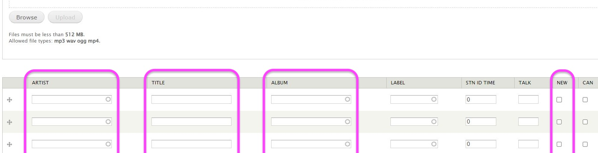

# CICK Playlister Usage

The CICK Playlister is a tool to help create playlists following a CICK radio show. It fetches track information from online streaming platforms to automate some of the work of logging which tracks were played.

It currently supports the following streaming platforms:
- Spotify

> [!TIP]
> Additional streaming platforms may be supported at a later date depending on demand, enthusiasm, and financial constraints.

## How to Use

The tool is activated by a bookmarklet. A bookmarklet is a special type of web browser bookmark that does not take you to a new web page. Look for a bookmark called `CICK Playlister` and click it. If you don't see the bookmark ensure that the bookmarks bar is visible via web browser settings. If the bookmark is still not visible skip to [troubleshooting](#troubleshooting-bookmark).

> [!NOTE]
> The tool will only work properly if you are viewing the smithersradio.com Create Program Playlist page.

Clicking the bookmark will bring up a window with a single text input field. Paste the URL of a playlist, album, or track into this field and hit `return` or click the `Fill` button next to it.

The following image shows how to access the URL of a playlist in Spotify. Similar functionality is available for albums and tracks.

If a window does not appear when you click the bookmark, or an error is reported on screen, skip to [troubleshooting](#troubleshooting-no-window).

The tool will fetch track information and fill the playlist's `ARTIST`, `TITLE`, `ALBUM`, and `NEW` fields.

> [!IMPORTANT]  
> The tool cannot fill the CAN (Canadian Content) field - this is still your responsibility.

## Limitations

The tool will not duplicate track information. If you attempt to add the same track twice no change will occur.

The tool will only fill empty rows in the playlist table. Once all rows are filled you must add rows to the table for it to make further changes.

The tool is the product of volunteer effort and may not be perfect. Please be patient if you encounter any issues and report them as described in [issues](#issues).

## Issues

If you encounter any issues with the tool please log an issue [here](https://github.com/captaincoordinates/cick-playlister/issues/). You will need a GitHub account to create an issue. If you do not want to create a GitHub account please report the problem to someone who knows more about the tool.

## Contributing

The tool is Free and Open Source Software (FOSS) and all source code is available within this repository. See [the README](./README.md) for information on building and extending the software. See the [list of outstanding issues](https://github.com/captaincoordinates/cick-playlister/issues) for areas where you may be able to contribute.

## Troubleshooting

### Troubleshooting Bookmark

Follow these steps if the bookmark has not yet been created in a user's browser profile.

1. Locate the tool's latest release. All files required for a release are provided in a directory which is named after the date it was created. Releases are available at `Documents\CICK Playlister\YYYY-MM-DD` (where `YYYY-MM-DD` is the date of the release). Always use the directory for the most recent release.

2. Open the `bookmarklet` JavaScript file in a text editor, such as Notepad. Do not double-click the file, as Windows may try to execute the script rather than display it. Right-click the file and select "Open with".

3. Select all text in the text editor (`Ctrl+A`) and copy it (`Ctrl+C`).

4. Follow the web browser's menu to create a new bookmark.

5. For the bookmark's name enter "CICK Playlister".

6. For the bookmark's URL paste (`Ctrl+V`) the content of the `bookmarklet` JavaScript file.

7. Ensure the tool's server component is running before testing the tool at smithersradio.com (see [below](#troubleshooting-no-window)).

### Troubleshooting No Window

Follow these steps if clicking the `CICK Playlister` bookmark does not open the URL input window or an error message is displayed.

1. Ensure your web browser is viewing smithersradio.com. The tool will not function properly with any other domain.

2. Look for an open terminal window, as shown below. The terminal may show more text than is shown in this screenshot. If you do not see an open terminal window it is possible that the tool's server component is not running.

3. In a new web browser tab navigate to http://localhost:8123/. If you see a web page with the title `CICK Playlister API` then the server component _is_ running. If the server component _is_ running, the web browser is viewing the correct domain, and clicking the bookmark still does not show the URL input window then it is time to [log an issue](#issues). If the server component is _not_ running, and no web page was displayed...

4. Locate the tool's latest release, as described in [Troubleshooting Bookmark](#troubleshooting-bookmark) step #1. Double-click on the `cick-playlister` application. A new terminal window should open, which can then be minimised. If a new terminal window does not open then it is time to [log an issue](#issues).

5. Click the bookmark while your web browser is viewing smithersradio.com to see if the issue is resolved.
